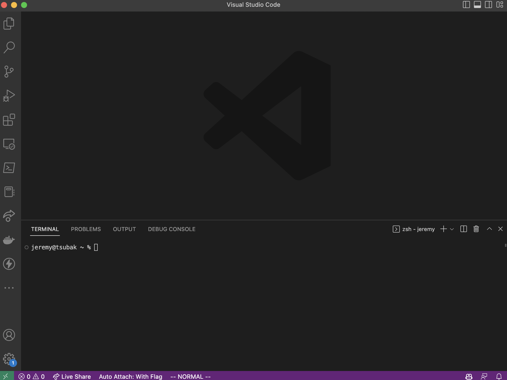
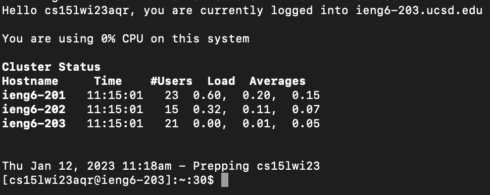
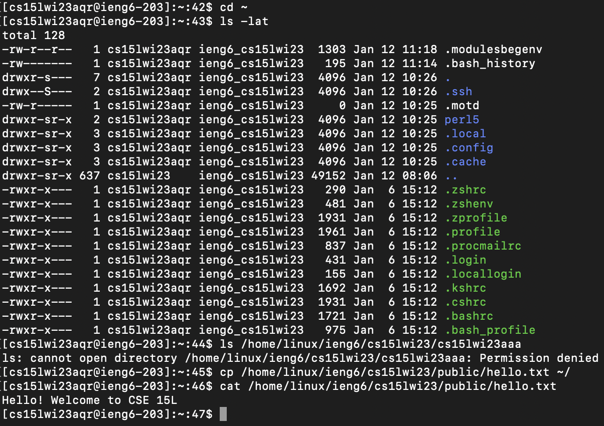

# Week 1 Lab Report - Setting up the CS15L environment: An Adventure

Setting up the environment requires three things:
- Installing VSCode
- Remotely connecting to the ieng6 server
- Verifying you can run commands

## Installing VSCode
Dive into the bowels of the internet to find the website for [VSCode](https://code.visualstudio.com/), linked here for your convenience. After selecting the correct version for your operating system and installing, you should see a window similar to this:



## Remotely Connecting
To remotely connect to the server, you need to have on hand your username, password, and the IP of the server you are connecting to, which in this case is `ieng6.ucsd.edu`. 

Then, open a terminal and enter this series of commands to connect via SSH. Replace everything in angle brackets, including the brackets, with your own information. If you are on windows, you may need to install SSH, but macOS and Linux platforms should have this tool preinstalled.

```zsh
% ssh <username>@ieng6.ucsd.edu
(<username>@ieng6.ucsd.edu) Password: 
```

When prompted, enter your password. As a security measure, the password won't show up on your screen, but it will still be entered. If you see a screen like this, congratulations! You've successfully logged in to the remote server via SSH.



## Verifying Commands

Lets verify that we can run some commands! Try running the following:

```zsh
% cd ~
% ls -lat
% ls /home/linux/ieng6/cs15lwi23/cs15lwi23aaa
% cp /home/linux/ieng6/cs15lwi23/public/hello.txt ~/
% cat /home/linux/ieng6/cs15lwi23/public/hello.txt
```

These commands respectively:
- Go to the home directory
- Show all the files in the home directory, including hidden files
- Try to list the files in the home directory of another user
- Copy a file
- Read the file that was just copied

Something interesting to note is that we cannot list the files of another user's home directory. This shows that we do not have sufficient permissions to do so.

You should get output similar to the following:
