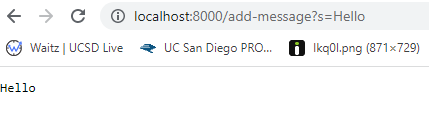
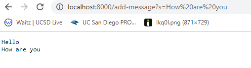

# Week 2 Lab Report - Servers and Bugs

- [Part 1](#part-1-string-server): String Server
- [Part 2](#part-2-bug-fixing): Bug Fixing
- [Part 3](#part-3-summary): Summary

## Part 1: String Server
For this part of the lab, I wrote a `StringServer` that keeps track of strings
added to it. Here is the code:

`StringServer.java`:
```java
import java.io.IOException;
import java.net.URI;
import java.util.HashSet;

class Handler implements URLHandler {
    String message = "";

    public String handleRequest(URI url) {
        try {
            if (url.getPath().equals("/add-message")) {
                String query = getQuery(url);
                message += query + "\n";
                return message;
            } else {
              return "404 Not Found";
            }
        } catch(Exception e) {
            return "400 Bad Request";
        }
    }

    private String getQuery(URI url) {
        String[] parameters = url.getQuery().split("=");
        if (parameters[0].equals("s")) {
            if (parameters.length < 2) {
                throw new IllegalArgumentException("Invalid query");
            }
            return parameters[1];
        }

        throw new IllegalArgumentException("Invalid query");
    }
}

class StringServer {
    public static void main(String[] args) throws IOException {
        if(args.length == 0){
            System.out.println("Missing port number! Try any number between 1024 to 49151");
            return;
        }

        int port = Integer.parseInt(args[0]);

        Server.start(port, new Handler());
    }
}
```

The code for `Server` was given in class. A demo of the code is shown below:

- 
  - `handleRequest` in the `Handler` class is called, with the argument being 
  the URL that the user entered. In this case, it would be
  `http://localhost:8000/add-message?s=Hello`. The `handleRequest` method then
  gets the query by calling `getQuery` and passing on the url, and adds it to 
  the `message` variable, which is currently an empty string. After all the code
  finishes running, the `message` variable contains the string `Hello\n`.
- 
  - `handleRequest` in the `Handler` class is called, with the argument being
  the URL that the user entered. In this case, it would be
  `http://localhost:8000/add-message?s=How%20are%20you`. The `handleRequest` 
  method then gets the query by calling `getQuery` and passing on the url, and
  adds it to the `message` variable, which currently contains the string
  `Hello\n`. After all the code finishes running, the `message` variable 
  contains the string `Hello\nHow are you\n`.

## Part 2: Bug Fixing

Bug chosen: `reversed` from `ArrayExamples.java`

Failure inducing input:
```java
@Test
  public void testReverseInPlace2() {
    int[] input1 = { 3, 4 , 5, 6 };
    ArrayExamples.reverseInPlace(input1);
    assertArrayEquals(new int[]{ 6, 5, 4, 3 }, input1);
  }
```

Non-failure inducing input:
```java
@Test 
	public void testReverseInPlace() {
    int[] input1 = { 3 };
    ArrayExamples.reverseInPlace(input1);
    assertArrayEquals(new int[]{ 3 }, input1);
	}
```

Output from running tests:
```
JUnit version 4.13.2
.E.
Time: 0.01
There was 1 failure:
1) testReverseInPlace2(ArrayTests)
arrays first differed at element [2]; expected:<4> but was:<5>
        at org.junit.internal.ComparisonCriteria.arrayEquals(ComparisonCriteria.java:78)
        at org.junit.internal.ComparisonCriteria.arrayEquals(ComparisonCriteria.java:28)
        at org.junit.Assert.internalArrayEquals(Assert.java:534)
        at org.junit.Assert.assertArrayEquals(Assert.java:418)
        at org.junit.Assert.assertArrayEquals(Assert.java:429)
        at ArrayTests.testReverseInPlace2(ArrayTests.java:16)
        ... 32 trimmed
Caused by: java.lang.AssertionError: expected:<4> but was:<5>
        at org.junit.Assert.fail(Assert.java:89)
        at org.junit.Assert.failNotEquals(Assert.java:835)
        at org.junit.Assert.assertEquals(Assert.java:120)
        at org.junit.Assert.assertEquals(Assert.java:146)
        at org.junit.internal.ExactComparisonCriteria.assertElementsEqual(ExactComparisonCriteria.java:8)
        at org.junit.internal.ComparisonCriteria.arrayEquals(ComparisonCriteria.java:76)
        ... 38 more

FAILURES!!!
Tests run: 2,  Failures: 1
```

Code before bug-fix:
```java
static int[] reversed(int[] arr) {
    int[] newArray = new int[arr.length];
    for(int i = 0; i < arr.length; i += 1) {
      arr[i] = newArray[arr.length - i - 1];
    }
    return arr;
  }
```

Code after bug-fix:
```java
static int[] reversed(int[] arr) {
    int[] newArray = new int[arr.length];
    for(int i = 0; i < arr.length; i += 1) {
      newArray[i] = arr[arr.length - i - 1];
    }
    return newArray;
  }
```
The original code goes through the whole array, first taking the second half and
assigning it to the first half of the array, and then assigns the first half of
the array back to the second half. This does not reverse the array, instead
making the first half be the same as the second half. The new code only goes
through half the array, and flips each element with the element on the other
half, thus reversing the array.

## Part 3: Summary

I learned that the `.`s and `E`s in the junit output actually mean something,
with the `.` meaning success, and the `E` meaning failure. I also learned that
when comparing doubles in junit, you can give a delta to account for
floating-point precision erros.